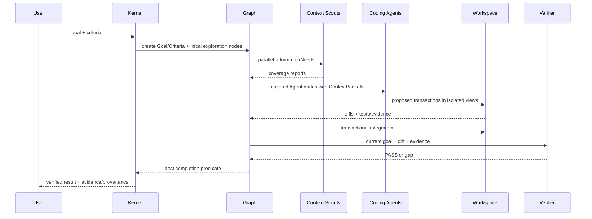

# Walkthrough — Repository Feature to Verified Completion

1. User states desired end state; RapidLM asks only genuinely missing criteria/authority.
2. Goal root and Criterion nodes are durable.
3. Context Scouts map code/tests/config, including checked negative findings.
4. Planner proposes a minimal graph; host validates capability/resource/write conflicts.
5. Independent code branches run in separate WorkspaceViews; background processes use monitors.
6. Transactions integrate through conflict/preimage checks and repository-native verification.
7. Writes invalidate stale context/evidence.
8. Independent verifier gets current contract/diff/evidence, not coder self-justification.
9. Rejection creates a gap/repair subgraph; PASS lets host complete.
